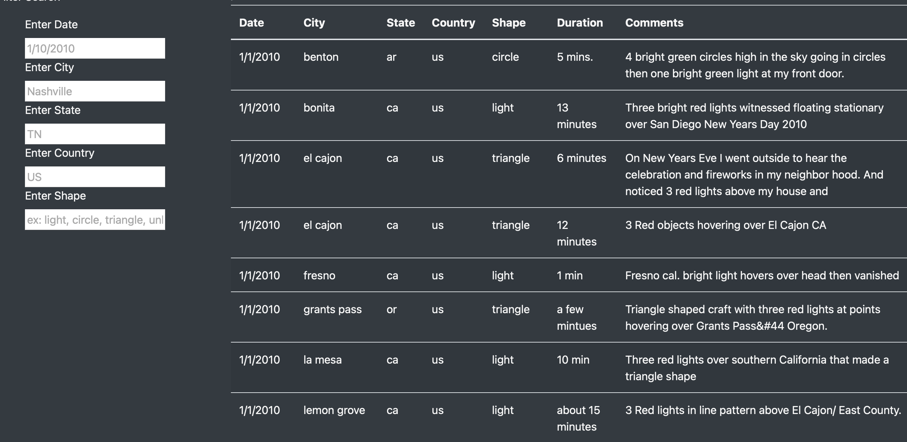

#Overview of Project: 

In this module, you will create a table to organize UFO data that is stored as a JavaScript array, or list. This table will have the ability to filter data based on certain criteria and will be created using JavaScript as the primary coding language.

On this project, I am helping Dana. Her goal is to create an interactive webpage that allows readers to parse the data around UFO sightings. To accopmlish this displaying data with an HTML page and a dynamic table to present has been the focus.

#Results: 

When a user visits the html page, by default the table will be displaying all available data. 

By using "Filter Search" user input section, the user can filter the data by day, city, state, country, and shape to narrow it down based on the interest.

#Summary: 

Javascript is a powerful language, and it is case-sensitive as well. Currently our data table has everything in lowercase. If user does not enter lowercase, it might be a dissapointing experience as it will not populate. To overcome this more code regarding to converting user entry into a lowercase might be a solution.

Another improvement can be made for the shape input. Currently it is a text field and it could be user-friendly if it was a drop-down list to select. This would also eliminate typos.